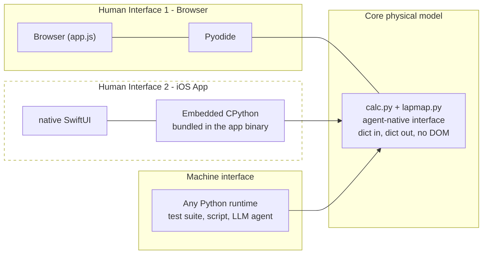
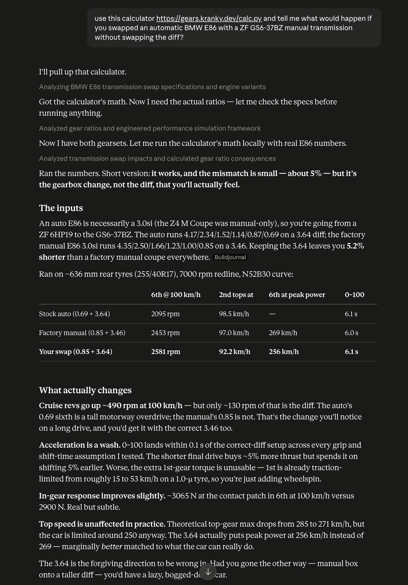
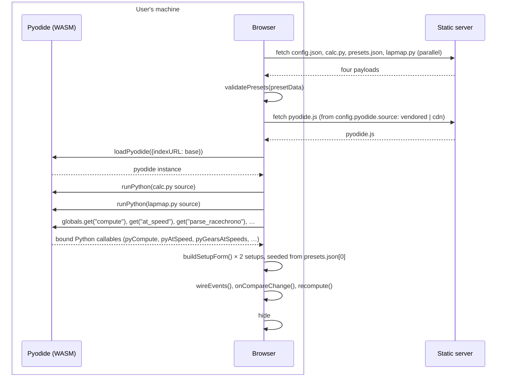
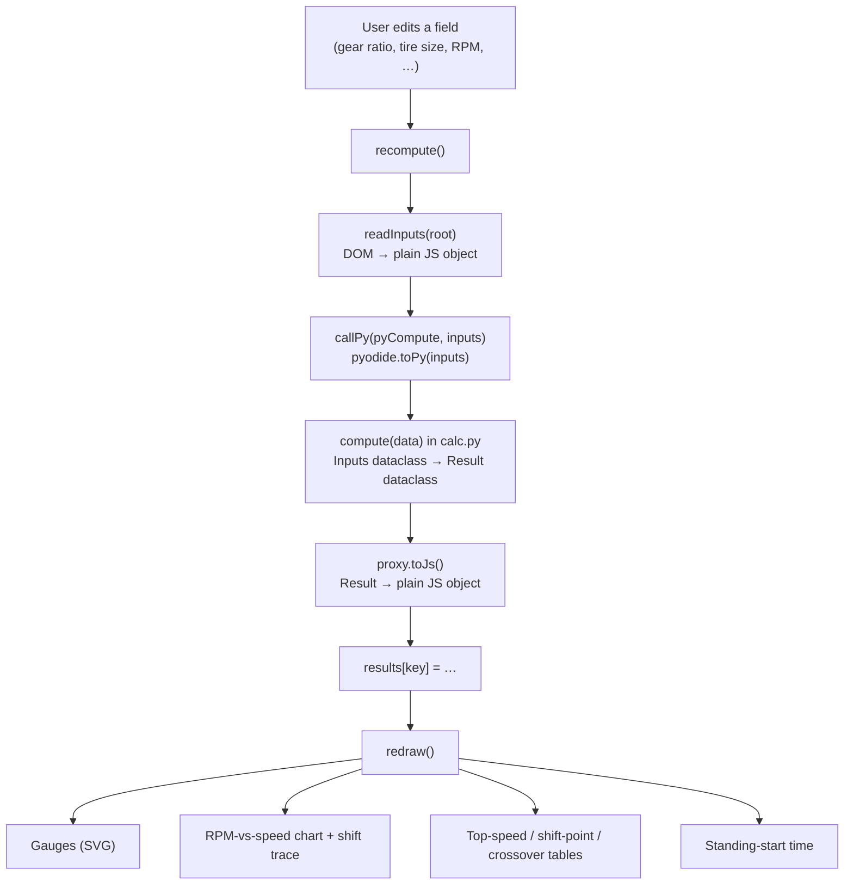
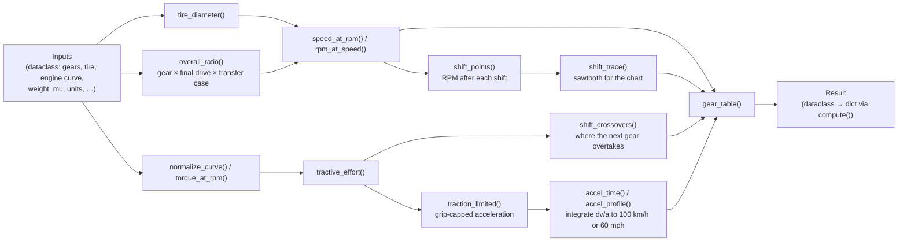

# Architecture

How the pieces fit together, and why they are built this way. For what the
app actually does, see the [README](README.md).

## The main idea

Multiple human interfaces, one agent friendly mathematical core. 

## High Level Design



- `app.js` is the first **human interface**: it
owns the DOM, the SVG gauges, the chart, the drag-to-scrub slider — everything
about *presenting* the drivetrain math to a human via a web browser. 

- `calc.py`
(and `lapmap.py`) is the core mathematical logical model, it is plain-stdlib Python,
dict in, dict out, no DOM and nothing Pyodide-specific anywhere in it. The
browser happens to load it into Pyodide and call it on every keystroke, but
nothing about the module *requires* a browser — anything else that can run
Python, a test suite, a script, an LLM-driven agent, can fetch the same file
and call the same functions directly, skipping the frontend entirely. See
[The math is a public, dependency-free module](#the-math-is-a-public-dependency-free-module)
below.

- The server, meanwhile, is dumb on purpose: it serves static files and does
nothing else. There is no JSON API and no backend endpoint to keep in sync
with the frontend — the frontend *is* the backend, loaded as a WASM module. Nothing crosses the network after the initial page load. Reload the page
offline (with the runtime vendored, see below) and it still computes. This app can be served as a static site just off of a CDN.

## The math is a public, dependency-free module

`calc.py` and `lapmap.py` are served as plain static files, byte-for-byte the
same ones the browser fetches at boot (`GET /calc.py`, `GET /lapmap.py`).
`compute()` (and the smaller entry points — `at_speed`, `tire_diameter`,
`gears_at_speeds`, `accel_profile`, …) take a dict and return a dict, exactly
what `app.js` sends across the Pyodide bridge — so there's no separate API
contract to reverse-engineer from the UI:

```bash
curl -O https://gears.kranky.dev/calc.py
python3 -c '
import calc
result = calc.compute({
    "gears": [4.32, 2.46, 1.66, 1.23, 1.0, 0.85],
    "final_drive": 3.64,
    "tire": 634.3,
    "max_rpm": 7000,
    "weight": 1325,
    "mu": 1.0,
    "torque_curve": [[1000, 150], [4000, 300], [7000, 200]],
})
print(result["max_speed"], result["shifts"])
'
```

An agent asked something like "what's the 0–100 km/h time for this gearset
with a 3.9 final drive instead" doesn't need to drive a browser, fill in a
form, and scrape the result back out of the DOM: it can fetch `calc.py` once
and call `compute()` directly, the same way `tests/test_calc.py` does. The
web page is one consumer of this module, not the only one.


### Real example of Claude using the site's calculator

Asked to compare a BMW E86 automatic against a manual gearbox swap, Claude
fetched `https://gears.kranky.dev/calc.py`, ran it locally with both gear
sets, and answered from the numbers it computed — no browser, no form-filling,
no screen-scraping. This is the payoff of the agent-native interface above:
the same file the site serves to itself is a complete, self-contained tool
for anything that can run Python.



## Shortcomings 

Of course, this is not a fully context optimised way for the agent to use the mathematical model.
Accessing the calculator this way means the agent will have the entire source code of `calc.py` in its context window. The benefit is just that it removes the need for browser interaction and allows the mathematical model to be driven via its source code, as long as agent has a python sandbox to execute it. 

A more optimistic way to look at `calc.py` is that it's a deterministic mathematical model of the gearing drivetrain physics that the agent does not need to spend any loops (and tokens) to probablistically reason through in order to answer a question about this particular knowledge domain, presented in a way such that the agent does not need to explore it via a typical human UI.
 

## Boot sequence

`main()` in `app.js` is the entire startup path. Four files are fetched in
parallel, the Pyodide runtime is loaded, `calc.py` and `lapmap.py` are executed
as scripts inside it, and the resulting Python functions are pulled out as JS
callables via `pyodide.globals.get(...)`. Only after that can the form exist,
because the form's defaults *are* `presets.json`'s first entries.



### Where Pyodide comes from

`app/static/config.json` decides. It is also the only place the Pyodide
version is written down: the browser reads it to build the runtime URL, and
`scripts/vendor_pyodide.py` reads it to know what to download, so a vendored
copy and a CDN copy cannot end up on different releases.

```json
{ "pyodide": { "source": "vendored", "version": "0.28.0", ... } }
```

`pyodideBaseUrl()` in `app.js` is the only place that resolves this — a
single fork in one function, not two code paths:

| `source` | Runtime comes from | Trade-off |
| --- | --- | --- |
| `"vendored"` (default) | `app/static/pyodide/`, same origin | Works with no network. The deploy carries ~12 MB and you must vendor first. |
| `"cdn"` | `cdn.jsdelivr.net` | Deploy carries no runtime and needs no vendoring step. Every load needs the network, and a third party serves code that executes in the page. |

Under `"cdn"` you can delete `app/static/pyodide/` entirely — nothing else
references it. Bump `version` once to move both.

There is deliberately no "CDN with a local fallback". A fallback would mean a
deploy that looks offline-capable under test and is not, or that silently
ships 12 MB nobody asked for. Pick one; it fails loudly if it can't load.

## Steady-state: editing a value

After boot, the loop is: user types → `recompute()` reads the form into a
plain JS object → that object crosses into Python via `pyodide.toPy()` →
`calc.compute()` returns a result dict → it crosses back via `proxy.toJs()` →
the gauges, chart and tables redraw from it. Nothing is persisted; the whole
`Inputs → Result` computation reruns on every keystroke, which is cheap
because it's pure arithmetic over a few hundred samples, not a network
round-trip.



Two setups (`a` and `b`) can be active when "Compare two setups" is checked;
`activeKeys()` just widens the loop above to run twice and every downstream
renderer (gauges, chart, tables) already takes a *list* of setups, so
comparison isn't a separate code path, only a longer list.

## calc.py: the math itself

`calc.py` is plain-stdlib Python with no Pyodide-specific code anywhere in
it — that's what lets `tests/test_calc.py` import and test it directly on
CPython, off a real interpreter, with the exact same source the browser runs.
Roughly:



`compute(data, step)` is the one function `app.js` calls on every keystroke;
`at_speed`, `tire_diameter`, `power_at_rpm`, `convert_curve` and
`convert_weight` are smaller, cheaper entry points called for single-value
lookups (e.g. redrawing the gauges as the speed slider is dragged, without
rerunning the full gear table).

### The model

Metric is the default:

```
overall_ratio = gear_ratio × final_drive × transfer_case
speed_kmh     = rpm × π × tire_diameter_mm / overall_ratio × (1 − slip) × 60 / 1e6
```

Selecting imperial units swaps the tire diameter to inches and the output to mph:

```
speed_mph     = rpm × tire_diameter_in / (overall_ratio × 336.135) × (1 − slip)
```

where `336.135 = 63360 / (π × 60)` converts inches-per-minute to miles-per-hour.

Tire diameter is derived from a standard tire size — `225/45R17` is a 225 mm
section width, a sidewall 45% of that width, on a 17 in wheel — with the
sidewall counted once above the rim and once below:

```
tire_diameter_mm = wheel_diameter_in × 25.4 + 2 × section_width_mm × aspect / 100
```

### Shift points

Shifting does not change road speed — the clutch reconnects the same wheels at
the same speed — so the engine drops to whatever RPM the next gear needs to hold
that speed:

```
rpm_after_shift = rpm_shift × ratio_next / ratio_current
```

Tire diameter, final drive, transfer case and converter slip all cancel out of
that expression: the RPM drop across a shift is a property of the gearbox alone,
and is identical in metric and imperial. Only the road speed at which the shift
happens depends on the rest of the drivetrain.

The chart overlays a **shift trace** — the engine's path through a full
acceleration run, climbing each gear to the shift RPM and then dropping straight
down to the next gear at the same road speed. Plotting RPM against speed (rather
than the reverse) makes this a sawtooth: road speed only ever increases through a
run, so it parameterises the whole path, while a given RPM occurs once per gear.

### Standing start

Given a vehicle weight and a tire grip figure, the calculator times a run from
rest to 100 km/h — or to 60 mph under imperial units, each being the benchmark
its readers know. The answer is in seconds either way.

At every road speed the force reaching the road is the smaller of what the engine
can send there and what the tires can hold:

```
F_engine = tractive_effort(gear at this speed)
F_grip   = grip_in_G × mass × 9.80665
a        = min(F_engine, F_grip) / (mass × spin)
```

`spin` is the drivetrain's own rotational inertia, expressed as an equivalent
mass: `1.04 + 0.0025 × overall_ratio²`. It grows with the square of the ratio,
which is why a shorter gear is not the free acceleration a plain `F = ma` would
promise. Integrating `dv / a` from rest to the target, and adding the shift dead
time once per upshift, gives the time.

Two consequences are worth knowing before reading a number off it. In the
traction-limited region the mass cancels — `grip × m × g / (m × spin)` — so it is
grip, not weight, that sets the launch; weight only starts to matter once the
engine, rather than the tires, is the limit. And taking the whole weight as load
on the driven axle ignores weight distribution and transfer, so the grip cap is
an optimistic bound rather than a launch model.

**What is not modelled:** aerodynamic drag, rolling resistance, drivetrain
efficiency losses, and the torque converter. Each needs data the calculator never
asks for — a frontal area and drag coefficient, a rolling-resistance coefficient,
an efficiency map, a converter's K-factor — and inventing defaults for them would
dress a gearing tool up as a vehicle-dynamics sim. Since nothing decelerates the
car during a shift, dead time simply adds.

Absolute times are therefore optimistic. Comparing two gearsets on one car —
which is what this calculator is for — they are sound.

## The other Python module: lapmap.py

`lapmap.py` is a second, independent script run into the same Pyodide
instance, for the RaceChrono-CSV lap-map feature: `parse_racechrono()` turns
an uploaded CSV into lat/lon/speed/time samples, `_project`/`_thin` turn that
into a plottable, decimated path, and `gears_at_speeds()` (calling back into
`calc.py`'s tables) colors each point by the gear a given setup would be in at
that speed. It shares the Pyodide runtime and the bridge helpers
(`callPy`/`callPyArgs`) but nothing else — it could be deleted without
touching `calc.py`.


## Running it locally

Vendor the Pyodide runtime once (~12 MB, gitignored):

```bash
uv run scripts/vendor_pyodide.py
```

Skip this if you set `pyodide.source` to `"cdn"` — see
[Where Pyodide comes from](#where-pyodide-comes-from) above.

```bash
uv run uvicorn app.main:app --host 127.0.0.1 --port 8000
```

Then open http://127.0.0.1:8000. Or run the module directly:

```bash
uv run python -m app.main   # same thing, with --reload
```

Tests:

```bash
uv run pytest
```

## Layout

| Path | Role |
| --- | --- |
| `app/main.py` | FastAPI app; mounts `app/static/` and serves it as-is. No routes, no API. |
| `app/static/index.html` | Page structure: gauges, inputs drawer, chart, tables, lap map. |
| `app/static/app.js` | Everything dynamic: boots Pyodide, reads/writes the DOM, draws SVG, bridges to Python. |
| `app/static/calc.py` | All drivetrain math. Pure stdlib. Runs both in Pyodide and under pytest. |
| `app/static/lapmap.py` | RaceChrono CSV parsing and gear-coloring for the lap map. Also pure stdlib. |
| `app/static/config.json` | Where the Pyodide runtime is fetched from, and its pinned version. |
| `app/static/presets.json` | Gearbox ratios, engine curves, vehicles, tires — the dropdown data and the form defaults. |
| `app/static/pyodide/` | Vendored runtime (gitignored), fetched by `scripts/vendor_pyodide.py`. Only present under `"vendored"`. |
| `scripts/vendor_pyodide.py` | Downloads the exact Pyodide version `config.json` pins. |
| `scripts/make_favicon.py` | Draws the favicons from one gear profile, stdlib only. |
| `tests/` | `test_calc.py` (the math), `test_config.py`/`test_presets.py` (guard the data files), `test_favicon.py` (icons match the script). |

