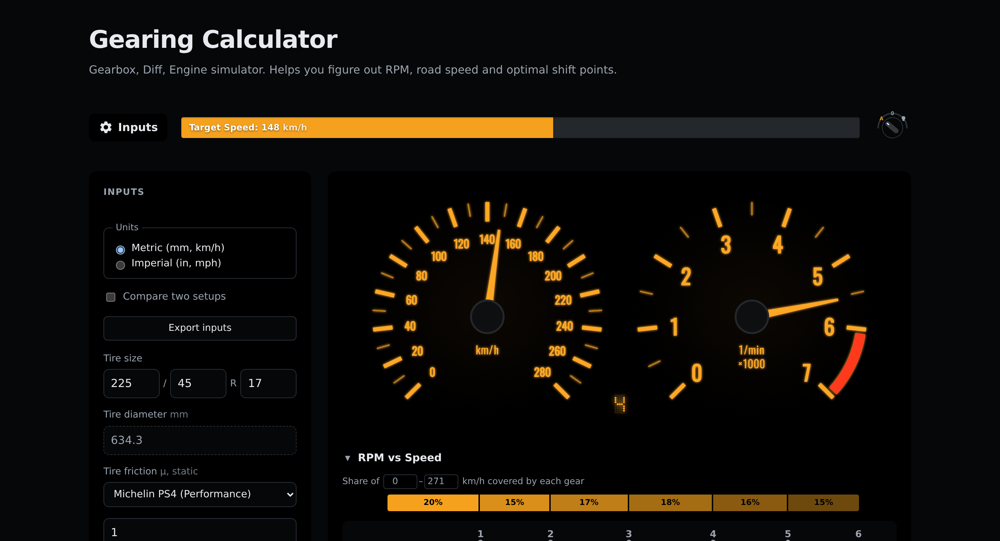
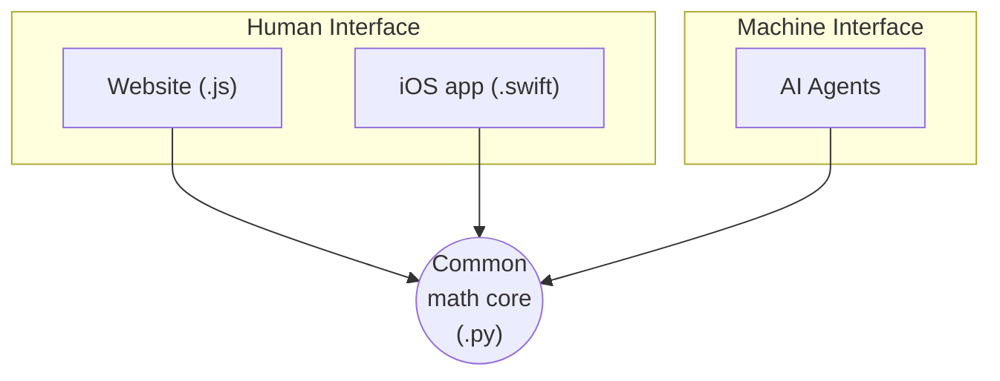

# Gearing Calculator

A modern vehicle gearing analyzer, inspired by
[blocklayer.com/rpm-gear](https://www.blocklayer.com/rpm-gear).

Have a play on **[gears.kranky.dev](https://gears.kranky.dev/)** (a served copy of this repo, no setup required).

Also available as a native iOS app: **[ThirdGear on Apple App Store](https://apps.apple.com/au/app/thirdgear/id6791802366)**.

## Why this is interesting

This little website is designed to be easy for both humans and machines (AI Agents) to use.

See
[ARCHITECTURE.md](ARCHITECTURE.md) for more details on the design and how that's wired up, the physics
behind the model, and how to run the app locally.

## Mathematical Features

Relates engine RPM to road speed through the drivetrain — transmission gear
ratio × final drive × transfer case, with tire diameter and torque-converter
slip — and shows a tachometer, speedometer, a chart of engine RPM against road
speed with one line per gear, a top-speed table, and a shift-point table.

Drag the speed slider to walk a whole acceleration run: the gear follows the
shift schedule and the tachometer sawtooths as each shift lands.

Other things it does:

- **Standing-start time** — estimates 0–100 km/h (or 0–60 mph) from vehicle
  weight and tire grip, accounting for each gear's own rotational inertia.
- **Compare two setups** side by side — same gauges, chart and tables, one
  overlay per setup, so a gearbox or final-drive swap is a direct comparison
  rather than two tabs to flip between.
- **Metric or imperial** units throughout, including tire size, torque, and
  weight.
- **Tire size → diameter**, computed from section width, aspect ratio and
  wheel diameter, plus a library of tire grip presets.
- **Gearbox, engine, vehicle and tire presets** for common cars, or type in
  your own.
- **Export/import a setup** as a JSON file, to save or share a configuration.
- **Lap map** — load a RaceChrono Pro CSV export and trace the lap, coloured
  by which gear each setup would be in at that point. No data leaves the
  browser.
- **Light, dark, or auto theme.**
- Works **fully offline** — the gearing math runs in the browser itself, not
  on a server, so once the page has loaded once it needs no network.
